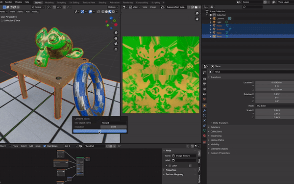

# Combine Objetcts
Add-on that combines multiple object and textures into single object and texture. 

Current limitations :  
>> Only supports 4 objects.  
>> Only supports BaseColor, Metallic, Roughness, and Normal texture.  
>> The height and the width of texture must match.                   

